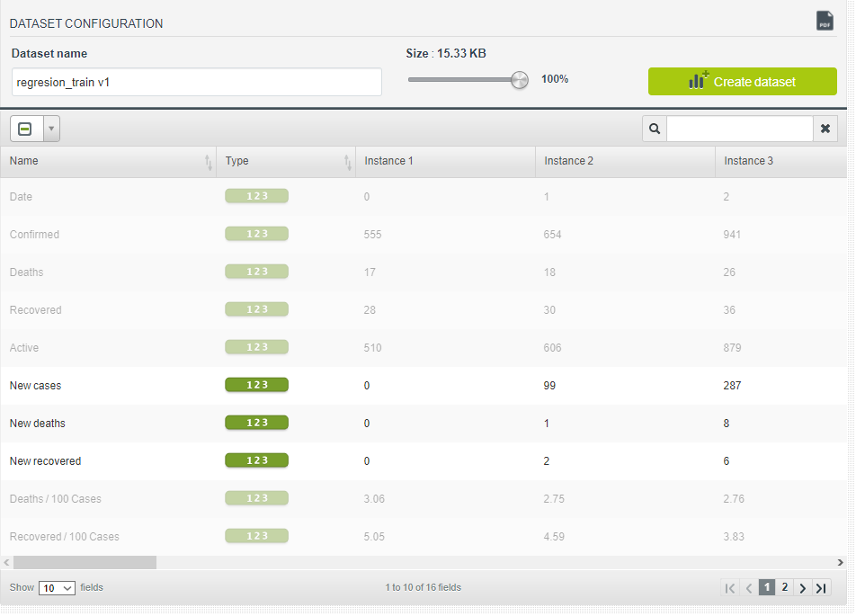
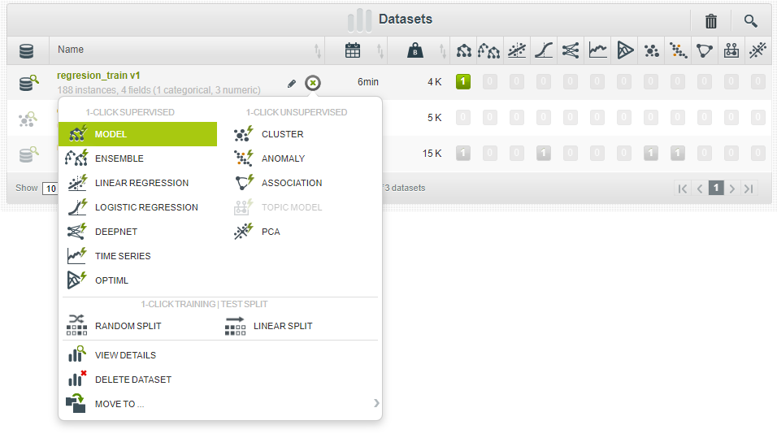
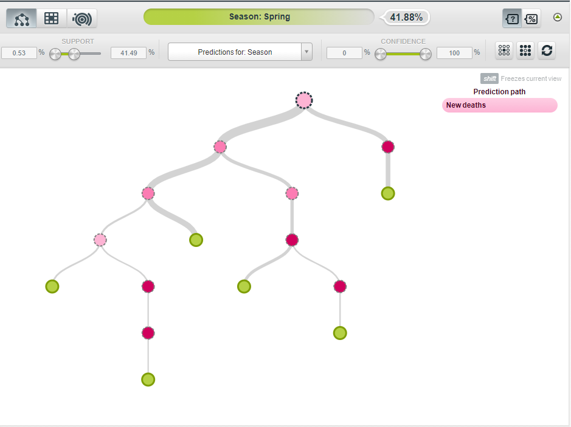
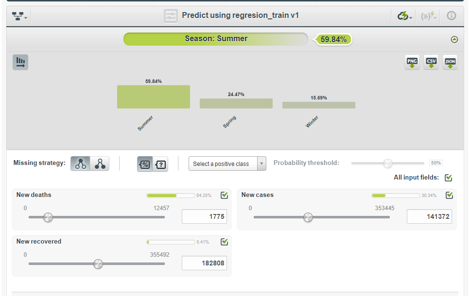
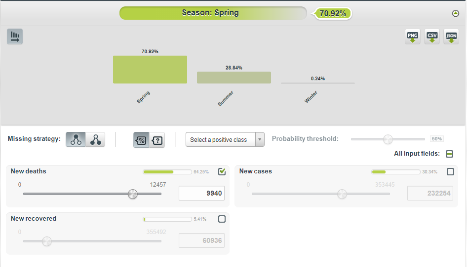
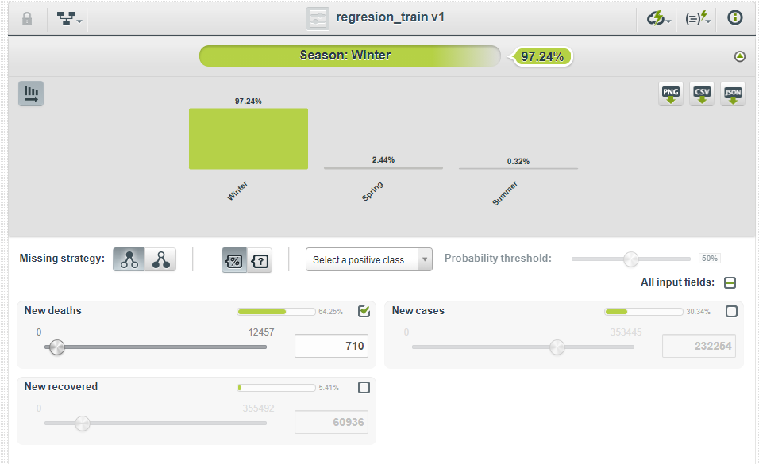
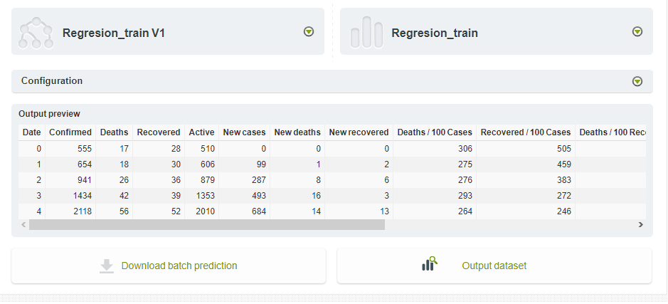

---
output:
  pdf_document: default
  html_document: default
---
# Trabajo FID

El dataset utilizado para todas las técnicas ha sido: https://www.kaggle.com/imdevskp/corona-virus-report?select=day_wise.csv

Alcance del proyecto: Análisis avanzado e investigación BIGML.
GitHub: https://github.com/jesusmonda/fid

Miembros del equipo:  
* Roberto Hermoso Núñez (robhernun) 
* Pablo García Barco (pabgarbar) 
* María del Carmen Arenas Zayas (mararezay) 
* Jesús Monda Caña (jesmoncaa, jmonda) 


# Predicción supervisada

Para estas predicciones hemos usado un dataset extraido de kaggle (https://www.kaggle.com/imdevskp/corona-virus-report?select=day_wise.csv) que muestra los datos del covid a nivel mundial divididos por días.
Trataremos de predecir la estación del año a la que pertenece el dato, teniendo en cuenta los casos, las muertes y las recuperaciones diarias.

## Clasificación mediante árbol

Los árboles de clasificación es un tipo de modelo de predicción que trata de predecir una variable en función de diversas variables de entrada. El árbol de clasificación lo componen una serie de nodos internos y externos así como los arcos que unen los nodos. Los nodos se les conocen como hojas del árbol y se marcan con una case o una distribución de probabilidad sobre las clases.


Instalamos pues, el paquete rattle para poder hacer la predicción mediante árbol

```{r eval=FALSE, include=FALSE}
install.packages("rattle")
install.packages("caret")
install.packages("caTools")
```

Cargamos el paquete
```{r}
library(rpart)
library(rpart.plot)
library(caret)
library(caTools)
```

```{r}
data_arbol <- read.delim('datos_nuevos_casos/regresion_train.csv', sep=",", head = TRUE)
```

Ahora vamos a generar y a dibujar el árbol.
```{r}
tree <- rpart(Season ~ New.cases + New.deaths + New.recovered, data_arbol, method="class")
rpart.plot(tree)
```
Como podemos ver en el árobl, pese a que estemos tratando de predecir mediante 3 variables, el árbol ha seleccionado la variable que considera mas importante para dividr el árbol, en este caso ha seleccionado la variable de "New Cases".

Y por último hacer validacion cruzada con arbol de decision para probar su eficacia.
```{r}
set.seed(1234)
split <- sample.split(data_arbol$Season, SplitRatio = 0.80)
training_set <- subset(data_arbol, split == TRUE)
test_set <- subset(data_arbol, split == FALSE)
```

```{r}
table(training_set$Season)
table(test_set$Season)
```
```{r}
folds <- createFolds(training_set$Season, k = 10)
```

```{r}
cvDecisionTree <- lapply(folds, function(x){
  training_fold <- training_set[-x, ]
  test_fold <- training_set[x, ]
  clasificador <- rpart(Season ~ ., data = training_fold)
  y_pred <- predict(clasificador, newdata = test_fold, type = 'class')
  cm <- table(test_fold$Season, y_pred)
  precision <- (cm[1,1] + cm[2,2]) / (cm[1,1] + cm[2,2] +cm[1,2] + cm[2,1])
  return(precision)
})
precisionDecisionTree  <- mean(as.numeric(cvDecisionTree))
precisionDecisionTree 


```
Como podemos ver, la precisión es de un 99.09%

Fuente: https://rpubs.com/rdelgado/405322
 
## Clasificación mediante Naive Bayes

Fuentes: https://fervilber.github.io/Aprendizaje-supervisado-en-R/ingenuo.html, https://rpubs.com/riazakhan94/naive_bayes_classifier_e1071

Naive Bayes es un modelo para predecir por probabilidad Bayesiana, de tal forma que clasifica el resultado en función de variables que a priori son independientes entre sí. La formula de Bayes es:

$$
P(B|A) = \frac{P(A|B)*P(B)}{P(A)}
$$
Donde:

1. P(A) es la probabilidad de que A sea cierto
2. P(B) es la probabildiad de que B sea cierto
3. P(A|B) es la probabilidad de que A sea cierto en función de B
4. P(B|A) es la probabilidad de que B sea cierto en función de A

Teniendo esto en cuenta, procedemos a la realización del modelo usando Naive Bayes

Primero instalarmos el paquete naivebayes, además es necesario usar Rtools (https://cran.r-project.org/bin/windows/Rtools/)
```{r eval=FALSE, include=FALSE}
install.packages("naivebayes")
```

Después cargamos el paquete
```{r}
library(naivebayes)
```

Cargamos los datos
```{r}
data <- read.delim('datos_nuevos_casos/regresion_train.csv', sep=",", head = TRUE)
```

E introducimos los datos, es importante factorizar la propiedad de "Season" para que funcione la función
```{r}
nb <- naive_bayes(as.factor(Season) ~ New.cases + New.deaths + New.recovered, data)

plot(nb)
```

Ahora vamos a mostrar la tabla de probabilidades, para cada atributo se muestra el valor medio que tienen estos atributos para cada estación
```{r}
nb$tables
```
De esta forma, Naive bayes es capaz de calcular la probabilidad de que la muestra se trate de una estación u otra según el número de casos, muertes y recuperaciones diarias. Usando la función de predict nos devolverá directamente el resultado de la predicción.

Ahora realizaremos la validacion cruzada para ver la precisión de naive bayes
```{r}

cvNaiveBayes <- lapply(folds, function(x){
  training_fold <- training_set[-x, ]
  test_fold <- training_set[x, ]
  clasificador <-  naive_bayes(as.factor(Season) ~ New.cases + New.deaths + New.recovered, training_fold)
  y_pred <- predict(clasificador, newdata = test_fold)
  cm <- table(test_fold$Season, y_pred)
  precision <- (cm[1,1] + cm[2,2]) / (cm[1,1] + cm[2,2] +cm[1,2] + cm[2,1])
  return(precision)
})
precisionNaiveBayes <- mean(as.numeric(cvNaiveBayes))
precisionNaiveBayes
```

La precisión entonces es de 93.45%

Fuente: https://rpubs.com/rdelgado/405322

## Clasificación mediante máquinas de vectores de soporte 

Fuentes: https://www.diegocalvo.es/svm-maquinas-de-vectores-de-soporte-en-r/

Este método de clasificación se basa en la busqueda un hiperplano que separe de forma óptima a todos los puntos de una clase, clasificandolos.
El algoritmo de SVM tratará de buscar el hiperplano que tenga la máxima distancia posible con los puntos, de esta forma se podrá hacer una mejor clasificación de los datos, 
etiquetando cada dato dependiendo de en que lado del hiperplano se encuentra.

```{r}
library(e1071)
# Ejecución del modelo SVM
data <- read.delim('datos_nuevos_casos/regresion_train.csv', sep=",", head = TRUE)

modelo = svm(as.factor(Season) ~ New.cases + New.deaths + New.recovered, data = data, kernel = "linear")
```
Hemos tratado de mostrar la gráfica pero no hemos sido capaces de hacerlo. Una vez sacado el modelo, podremos hacer las predicciones mediante la función predict, esta función devolverá directamente el valor de la predicción.

Ahora vamos a realizar la validacion cruzada para comprobar la eficacia de las máquinas de vectores de soporte
```{r}
library(e1071)
cvKernelSVM <- lapply(folds, function(x){
  training_fold <- training_set[-x, ]
  test_fold <- training_set[x, ]
  clasificador <- svm(as.factor(Season) ~ ., data = training_fold, kernel = "linear", cost = 10)
  prediccion <- predict(clasificador,new=training_set)
  mc <- with(training_set,(table(prediccion,Season)))
  y_pred <- predict(clasificador, newdata = test_fold)
  cm <- table(test_fold$Season, y_pred)
  precision <- (cm[1,1] + cm[2,2]) / (cm[1,1] + cm[2,2] +cm[1,2] + cm[2,1])
  return(precision)
})

precisionKernelSVM <- mean(as.numeric(cvKernelSVM))
precisionKernelSVM

```
Como podemos ver la precisión es de un 98.09%

Fuente: https://rpubs.com/rdelgado/405322

## Conclusiones

Como hemos podido observar el árbol es mucho mas preciso que el resto de modelos. Los árboles de decisión además tienen la ventaja de que pueden ser usados tanto para predecir variables cualitativas y cuantitativas, además de que son simples de entender e interpretar. Sin embargo, los árboles de decisión pueden resultar algo inestables ante cualquier cambio en los datos de entrada, puede dar lugar a un árbol totalmente diferente.

Por otro lado, aunque las maquinas de soporte de vectores tenga una eficacia algo menor, de un 98%, son bastante eficaces igualmente.Además, las maquinas de soporte de vectores tienen la ventaja de que son bastante mas exactas en espacios de dimensiones altos. Aunque, tienen el inconveniente de que no son muy eficientes si el dataset es muy grande.

Por último, aunque el de Naive Bayes sea de los tres con un 93.45% el que menos tasa de acierto tenga, es de los clasificadores más útiles cuando presuponemos la independencia entre las variables en comparación con otros. Sin embargo, también puede ser considerada un problema si los aplicamos a los datos de la vida real, puesto que Naive Bayes asume la independencia de los predictores, y en la vida real es complicado obtener un conjunto de predictores que sean totalmente independientes.

# Predicción no supervisada

Para estas predicciones hemos usado un dataset extraido de kaggle (https://www.kaggle.com/imdevskp/corona-virus-report?select=day_wise.csv) que muestra los datos del covid a nivel mundial divididos por días.

Las técincas de predicción no supervisada tiene el objetivo de explorar un conjunto de datos para encontrar alguna estructura o forma de organizarlos. Por ello es muy frecuente emplear estas técnicas para agrupar datos con características o comportamientos similares.

En este apartado veremos algunas técnicas de aprendizaje no supervisado empleadas para la organización de los datos.

## 1. KMeans

Fuente: https://rpubs.com/williamsurles/310847, https://www.geeksforgeeks.org/clustering-in-r-programming

K-Means es una técnica iterativa de agrupamiento duro que utiliza un algoritmo de aprendizaje no supervisado. En él, el número total de grupos es predefinido por el usuario, y en base a la similitud de cada punto de datos, los puntos de datos se agrupan. 
Es decir, consiste en una agrupación de datos, en la que el conjunto de datos se divide en varios grupos llamados "clusters" en función de su similitud. Después de la segmentación de los datos se producen varios grupos de datos, y todos los objetos de un grupo comparten características comunes. 


Cargamos librerias
```{r}
library(ggplot2)
```

Cargamos y visualizamos los datos
```{r}
data <- read.delim('datos_nuevos_casos/regresion_train.csv', sep=",", head = TRUE)
head(data)

ggplot(data, aes(New.cases, Deaths, Recovered, color = Season)) + geom_point()

```

Al interpretar los datos, podemos obsevar como hay 3 grupos de datos diferenciados. (1 = winter, 2 = Spring, 3 = Summer)

Realizamos una primera prueba de K-means con 2 cluster, para ello utilizamos todas las columnas del dataset exceptuando la de Seasons: 
```{r}
km.out <- kmeans(data[0:15], centers = 2, nstart = 20)
summary(km.out) # Inspect the result
print(km.out)
plot(data, 
  col = km.out$cluster,
  main = "k-means with 2 clusters")
```

Como podemos observar en la consola R hay un buen ratio BSS/TSS *, ya que es del 75.9 %. Pero se podría mejorar.

(*) BSS -> la suma de las distancias al cuadrado de cada observación con la media de la muestra global, obtenemos total_SS.
    TSS -> la suma de las distancias cuadradas de estas tres medias a la media general, obtenemos between_SS.

Necesitamos elegir k, el número de clusters idóneo. 
Para ello hay un punto donde la curva SSE comienza a doblarse conocido como el punto del codo. Se cree que el valor x de este punto es un equilibrio razonable entre el error y el número de cúmulos. En nuestro caso, tras observar la gráfica podemos ver que es 3.
```{r}
wss <- 0
for (i in 1:15) {
  km.out <- kmeans(x = data[0:15], centers = i, nstar=20)
  wss[i] <- km.out$tot.withinss
}
plot(1:15, wss, type = "b", xlab = "Number of Clusters", ylab = "Within groups sum of squares")
```
Como se puede ver en la gráfica empieza a decrementar en x=3, por lo que emplearemos k = 3.
```{r}
k <- 3
km <- kmeans(data[0:15], centers = k, nstart = 20)
print(km)
plot(data,
     col = km$cluster,
     main = paste("k-means clustering with", k, "clusters"))

table(km$cluster, data$Season)
```

Al emplear k = 3 se ha obtenido un ratio BSS/TSS del 90%, el cual es mejor que el anterior (k=2).

Visualizamos el resultado:
```{r}
ggplot(data, aes(New.cases, Deaths, Recovered, color = km$cluster)) + geom_point()
```
Como se puede ver en la gráfica han salido 3 grupos diferenciados de datos, los cuales se corresponden con la división inicial por Seasons. De esto podemos concluir que la agrupación de k-means ha tenido un resultado satisfactorio, ya que equivale a las 3 Seasons.


## 2. Principal component analysis

Fuente: https://rpubs.com/Cristina_Gil/PCA, https://lgatto.github.io/IntroMachineLearningWithR/unsupervised-learning.html#principal-component-analysis-pca

PCA es una de las técnicas de aprendizaje no supervisado, las cuales suelen aplicarse como parte del análisis exploratorio de los datos.

Nosotros emplearemos esta técnica como herramienta para la visualización de datos, aunque también se suele emplear para la reducción de dimensiones (variables).

En este caso cabe destacar que, aunque hemos investigado y estudiado como sería el proceso, debido a un fallo persitente con la instalación de la libreria "FactoMineR" no nos ha sido posible ejecutar la función PCA. Por tanto, nos resulta imposible visualizar la técnica. Aún así, hemos querido dejar constancia del trabajo realizado:


Procedemos a realizar las instalaciones pertinentes:
```{r eval=FALSE, include=FALSE}
install.packages("FactoMineR")
```

```{r}
library("FactoMineR")
```

Cargamos los datos:
```{r}
data <- read.delim('datos_nuevos_casos/regresion_train_kmeans.csv', sep=",", head = TRUE)
head(data)
```

Antes de aplicar un PCA, las observaciones tienen que moverse al centro del eje de coordenadas, esto es, centrarlas para que tengan media 0, para así eliminar posibles bias en las mediciones.
La función prcomp() es una de las múltiples funciones en R que realizan PCA, prcomp() centra las variables para que tengan media 0
```{r}
pca <- prcomp(data)
```

Otro de los outputs de la función prcomp() es la desviación estándar de cada componente principal:
```{r}
pca$sdev
```

La varianza explicada por cada componente principal la obtenemos elevando al cuadrado la desviación estándar:
```{r}
pca$sdev^2
```

Aplicamos PCA
```{r}
pca2.nci <- PCA(X = data, scale.unit = TRUE, ncp = 64, graph = FALSE)
```

Mostramos dos ejemplos para representar las observaciones sobre las dos primeras componentes principales:
```{r}
library(factoextra)
fviz_pca_ind(pca, geom.ind = "point", 
             col.ind = "#FC4E07", 
             axes = c(1, 2), 
             pointsize = 1.5) 
```

## DBSCAN

Fuente: https://rpubs.com/elias_jurgen/605966

Es un método de clusterización adecuado para buscar patrones de agrupación en el espacio físico. Este algorítmo agrupa los puntos que están más cercanos respecto a la distancia euclidiana, además para este algorítmo se tiene que cada cluster contendrá un mínimo de puntos.

Este método necesita sólo dos parámetros
  ·eps: Esta es la distancia que se tomará como radio de los clusters. Este parámetro se puede elegir “correctamente” basándose en la distancia del dataset (utilizando un K-distance Plot). Es preferible utilizar valores pequeños
  
  ·minPoints: Mínimo de números que deben estar en un grupo para que el algorítmo lo tome com un cluster. Este número se puede elegir basándose en el número de dimensiones del dataset.
  
  ·D es el número de dimensiones del dataset. Este parámetro debe ser proporcional al tamaño del dataset pero nunca es menor que 3

Procedemos a realizar las instalaciones pertinentes:
```{r eval=FALSE, include=FALSE}
install.packages("dbscan")
```

```{r}
library("dbscan")
```

Cargamos los datos. Sólo hay 3 tipos de Seasons, así que lo ideal sería obtener esos 3 clusters. Tenemos 16 variables, una de ella es "Seasons" que es la clasificación a la que tratariamos de llegar, por ello la vamos a eliminarla del dataset. Una vez eliminada tendrémos 15 variables restantes en la base, así que tomaremos 16 como el mínimo número de puntos.
```{r}
data <- read.delim('datos_nuevos_casos/regresion_train.csv', sep=",", head = TRUE)
data$Season <- NULL
head(data)
```

Ahora, para elegir el radio de los grupos utilizaremos un K-Distance Plot.
```{r}
#df: dataset sin variable "species"
#k: el número mínimo de puntos que elegimos

kNNdistplot(data, k = 15)
abline(h = 1000000, lty = 2)
```

### eps=1000000
Por lo que se observa en la gráfica tomaremos eps=1000000

Al aplicar la función y representar gráficamente el resultado se puede observar 1 clusters. Se ve claramente como hemos obtenido un número erroneo de clusters, esto puede deberse al valor de eps.
```{r}
cl<-dbscan(data,eps=1000000,MinPts = 5)
unique(cl$cluster)
hullplot(data,cl$cluster, main = "Convex cluster Hulls, eps=1000000")
```

### eps=3000000
Tomaremos eps=3000000

Se procede a aplicar la función ahora con un número más elevado de eps, pero el resultado sigue persistiendo.
```{r}
cl<-dbscan(data,eps=3000000,MinPts = 5)
unique(cl$cluster)
hullplot(data,cl$cluster, main = "Convex cluster Hulls, eps=3000000")
```

Podemos observar como siempre obtenemos 1 cluster independientemente del valor del eps

Por último, hacemos la prueba con muchos valores de eps y mostramos el número de clusters devuelto. 
Los valores de eps van desde 1000000 hasta 5000000, lo sabemos gracias a la gráfica anterior generada mediante kNNdistplot, pero de 1000 en 1000 para agilizar el proceso. Podemos observar como siempre devuelve 1 cluster.
```{r warning=FALSE}
wss <- 0
value <- 0
i <- 1000000
index <- 0
while(i<=5000000) {
  km.out <- dbscan(data,eps=i,MinPts = 5)
  wss[index] <- km.out$cluster
  value[index] <- i
  i<-i+1000
  index <- index + 1
}
plot(value, wss, type = "b", xlab = "Valor de EPS", ylab="Number of Clusters")
```

## Heatmaps (https://rpubs.com/Joaquin_AR/310338)

Fuente: 
```{r eval=FALSE, include=FALSE}
if (!requireNamespace("BiocManager", quietly = TRUE))
    install.packages("BiocManager")
BiocManager::install("ComplexHeatmap")
install.packages("viridis")
```


```{r}
library(ComplexHeatmap)
library(viridis)
colores <- magma(256)
```

Los heatmaps son el resultado obtenido al representar una matriz de valores en la que, en lugar de números, se muestra un gradiente de color proporcional al valor de cada variable en cada posición. Se consigue representar más información que con un simple dendrograma y se facilita la identificación visual de posibles patrones característicos de cada cluster.

Cargamos los datos
```{r}
data <- read.delim('datos_nuevos_casos/regresion_train.csv', sep=",", head = TRUE, row.names = 1,
                  as.is=TRUE)
data$Season <- as.numeric(as.factor(data$Season))
head(data)
data <- as.matrix(data)
data <- scale(data)
```
Podemos observar como la columna Seasons tiene 3 cluster a diferencia de las demas columnas.
```{r}
Heatmap(matrix = data, name = "Clusters",
        row_title = "observaciones",
        column_title = "variables",
        row_names_gp = gpar(fontsize = 7),
        clustering_distance_columns = "euclidean",
        clustering_distance_rows = "euclidean",
        clustering_method_columns = "average",
        clustering_method_rows = "average")
```


# BIGML


Ahora vamos a tratar una herramienta en la nube llamada BIGML, en concreto, nos centraremos en la capacidad de predicción de esta aplicación. Usaremos para ello nuestro dataset, pero para que podamos hacer el estudio sobre las variables que hemos usado en el aprendizaje supervisado, tendremos que generar un nuevo dataset dentro de la aplicación.



Como es lógico, tendremos que crear un modelo para poder hacer la predicción, por lo que mediante la interfaz crearemos dicho modelo


Como podemos ver a continuación el modelo que ha generado es un árbol


Podemos hacer las predicciones de varias formas distinas, para empezar la mas simple es una interfaz que mediante un pequeño formulario podemos introducir los valores de los datos y arriba nos mostrará una pequeña gráfica indicando la probabilidad de que pertenezca a una categoría u otra.


Incluso como podemos ver, tenemos la opción de desactivar los atributos que queramos, si por ejemplo desactivamos los atributos de "new cases" y de "new recovered", observamos que hay 2 franjas bien definidas en donde se define claramente a que clase pertenece. La primera es en invierno donde no había una gran cantidad de tasa de muertos y la otra es en primavera, donde había una gran cantidada de muertes diarias, sin embargo en verano esa tasa varía bastante, por lo que aparece, aunque sea menos probable, en estas dos franjas.



 
 Después, podemos realizar una predicción mediante preguntas, es decir, que la interfaz irá preguntando cada parámetro uno a uno. Al fin y al cabo la finalidad es la misma, predecir un caso concreto.
 


Lo mas interesante, es la opción de "Batch predict", que nos permite introducir un dataset para que prediga el valor que estamos analizando de cada uno de los datos. Ahorrando sin duda bastante tiempo.


Esta opción devolverá un dataset nuevo con una columna nueva con la predicción de cada dato.

